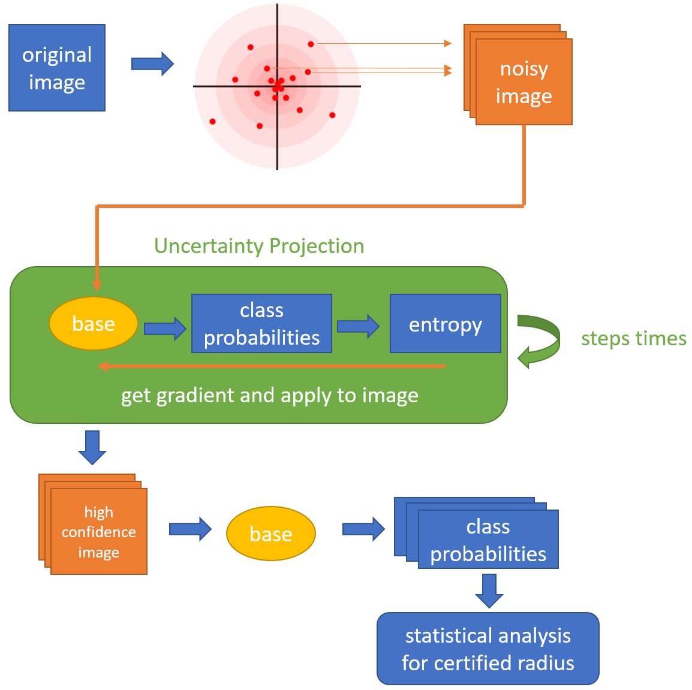

# Attack is the Best Defense: Obtaining Stronger Robustness Guarantees in Randomized Smoothing through Uncertainty Projection

We explored the idea of improving robustness guarantees through integrating uncertainty information into the prediction pipeline. Specifically, in this paper, we
1. developed a uncertainty projection model that utilizes BNNs to build a base classifier that is robust to
Gaussian noise with large radius
2. evaluated the said method in terms of accuracy and certified radius, and compared it against the
state-of-the-art methods on the CIFAR-10 dataset
3. provided insights into how training methods, hyperparameter configurations, and base classifier
calibration might impact the effectiveness of our method.

[See our full project report](https://n.ethz.ch/~qifeng/asset/AttackIsTheBestDefense.pdf)

<div style="text-align: center;">
  
</div>

Note: Our codebase is a fork of https://github.com/Hadisalman/smoothing-adversarial

# Reproducing our experiments
## Training
### With Data Augmentation and Adversarial Training
```
python code/train_pgd.py cifar10 cifar_bbb_resnet18 <experiment_folder> --noise_sd <augmentation_noise> --adv-training --epsilon <PGD_training_epsilon> --bbb --bbb-ws-train 4 --bbb-kl-posterior-prior-weight 0.000002 --lr 0.01
```

### With noise standard deviation sampling [and aleatoric label noise]
```
python code/train_pgd.py cifar10 cifar_bbb_resnet18 <experiment_folder> --noise_sd <augmentation_noise>  --noise-sd-sampling --bbb --bbb-ws-train 4 --bbb-kl-posterior-prior-weight 0.000002 [--max-aleatoric-label-noise 0.5] --lr 0.01
```

## Certification
### Standard
```
python code/certify.py cifar10 <experiment_folder>/checkpoint.pth.tar 0.12 <experiment_folder>/certification --skip 20 --batch 2000
```

### Using Uncertainty Projection
```
python code/certify.py cifar10 <experiment_folder>/checkpoint.pth.tar 0.12 <experiment_folder>/certification_intermediate --skip 20 --batch 2000 --use-intermediate --pgd-epsilon <up-epsilon> --pgd-steps <up-steps>
```

### Comparing certification results
```
python code/compare_certifications.py <certification_file_baseline> <certification_file_new>
```

## Reproducing Entropy Result
```
python code/compare_entropy.py cifar10 <experiment_folder>/checkpoint.pth.tar 0.12 <experiment_folder>/entropy_results --bbb-samples 8
```
